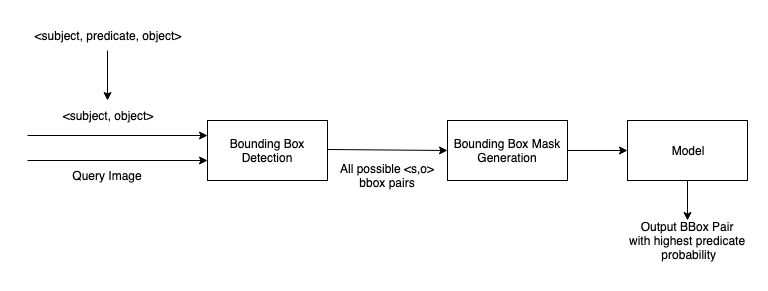
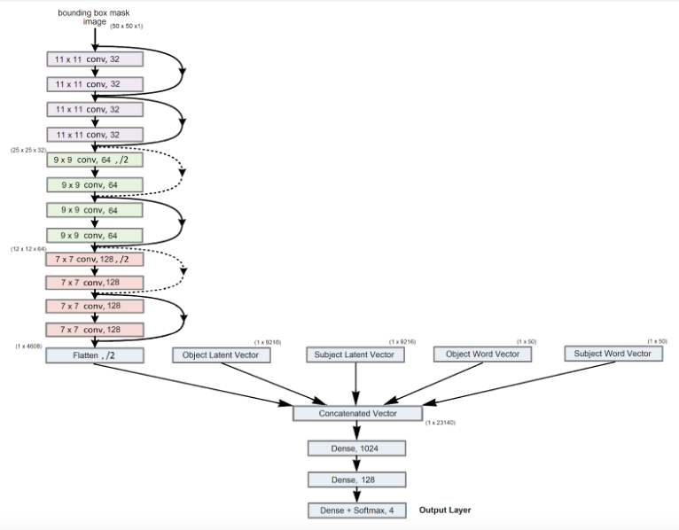
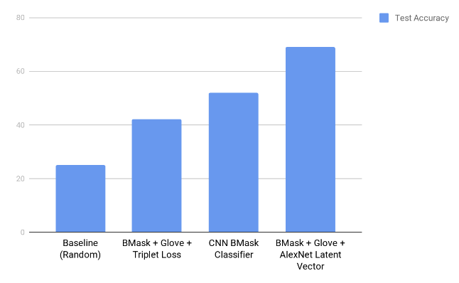
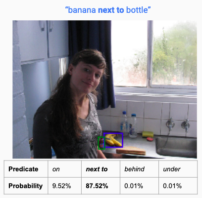
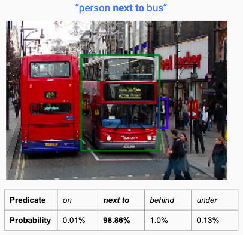
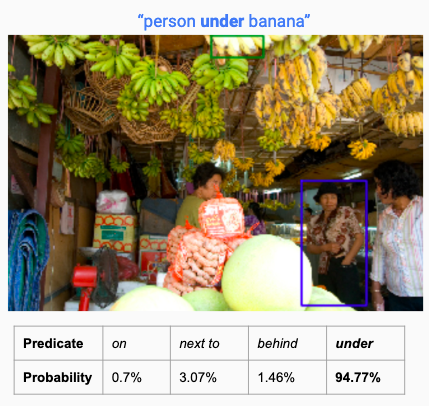
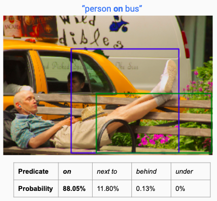

### Abstract

The goal of our project was to identify specific visual relationships in images, to make progress towards genuine scene understanding. We detect object-object relationships in an image based on a textual description given by the user; a subject, object and predicate triplet (for instance, ‘plate next to pizza’). For this, we plan to optimize a triplet loss function using a pre-trained convolutional neural network (VGG16). 

### Teaser Figure

<center></center>

### Introduction

The existing implementations for visual relationship detection output all possible object-object relationships when fed an image. We intend to detect specific object pairs and a relationship predicate between them that match the given textual input while at the same time try and minimize the number of erroneous pairs our model outputs.

### Approach

We slightly tweaked our problem statement from determining the bounding boxes of a particular <subject, predicate, object> instance in an image to classifying all possible combinations of <subject, object> bounding boxes in the image and returning the pair with the highest probability of the input predicate. Our solution's overall architecture is as follows:

<center></center>

#### Object Detection

In our first module of the project, we used the Faster R-CNN object detector in PyTorch. We used the pre-trained Faster R-CNN ResNet-50 model, to process our input image tensor of the form [n, c, h, w] and min size of 800px, where

	- n is the number of images
	- c is the number of channels , for RGB images its 3
	- h is the height of the image
	- w is the width of the image

The model returns: 

	- Bounding boxes [x0, y0, x1, y1] of all predicted classes of shape (N,4) where N is the number of classes predicted by the model to be present in the image.
	- Labels of all predicted classes.
	- Scores of each predicted label.

We also use the <subject, predicate, object> from the input query to obtain all combinations of bounding boxes between <subject, object> detected in the image to pass as input to our next module.

#### Data Collection

We analysed the VRD images' annotations to learn more information about the nature of the dataset and common subjects, predicates and objects, that had more samples. To further simplify the scope of our project, we narrowed the predicates we were considering to the following :

```
	["on", "next to", "behind", "under"]
```

We condensed the VR dataset to contain only relevant examples to the following predicates ending up with 3994 examples in our train set, and 999 images in our test set respectively. These examples contained information about 19370 and 4909 relationships in the above 4 categories, in the train and test set, and the distribution of the relationships are shown below.

<center></center>
<center></center>

There is a slight bias in the dataset towards certain predicates, a problem we solved later by modifying our loss function. We also used heuristics to generate triplets of <anchor, positive, negative> examples, in order to test our approach to solving the problem using a triplet loss function.

#### Model Architectures

Our original thought process was to use the bounding box masks of the <subject, object> pairs in the image to learn the possible relationship between them. We tried 3 different approaches to solve this problem, and have explained them below.

	* Our initial approach was to use the generated bounding box masks for all images in the training dataset, and train a neural network classifier to learn patterns in their spatial arrangement. We used a simple CNN with 5 hidden layers, followed by MaxPooling and BatchNormalization at the end of each hidden layer. This is then followed by 3 Fully Connected layers with a softmax activation in the last layer, to return probabilities for our predicate classes. We performed some basic testing to determine the hyperparameters for the neural network architecture above. The hyperparameters are as follows:

	- Number of hidden layers: 5
	- Activation: ReLU
	- Learning rate: 0.001
	- Dropout (after last hidden layer): 20%
	- Optimizer: Adam

	We noticed our model was biased towards the "on" class, so we changed our loss function from categorical cross-entropy to focal loss. Focal loss involves reshaping the cross entropy loss such that it down-weights the loss assigned to well-classified examples. We noticed an improvement in our results, after applying this loss function, though we spent a fair bit if  time tuning the hyperparameters, gamma and alpha, ending up with 4.0 and 1.0. Gamma represents the rate at which easy examples are down-weighted and alpha balances focal loss.

The bounding box information alone was insufficient to detect predicates in an image. We considered using the images themselves but there were issues with this: too many features where each image pixel acts as a feature and images may be of different sizes (whereas bounding boxes can be resized).

	* In our next approach, we used the generated bounding box masks for the <anchor, positive, negative> images in our dataset, and concatenated them with the Glove word embeddings for the <subject, object> to train a neural network using the triplet loss function. We used a simple CNN with 4 hidden layers, followed by MaxPooling at the end of each hidden layer. This is then followed by a Fully Connected layer that generates embeddings of size 7 for the input images. We performed some basic testing to determine the hyperparameters for the neural network architecture above. The hyperparameters are as follows:

		- Number of hidden layers: 4
		- Activation: ReLU
		- Learning rate: 0.0001
		- Optimizer: Adam

	* In our final approach, we felt we could exploit information from within the image itself to allow the model to learn better. We used the generated bounding box masks for the <subject, object> images in our dataset, and used a CNN with 3 stacks of 4 hidden layers, followed by MaxPooling at the end of each stack. The flattened output of this network is then concatenated with the Glove word embeddings for the <subject, object> and the latent vector of the <subject, object> images within their bounding boxes. This vector was generated using weights from the penultimate layer of the AlexNet model as a high-level feature extractor. 

	This is then followed by 3 Fully Connected layers with a softmax activation in the last layer, to return probabilities for our predicate classes. We performed some basic testing to determine the hyperparameters for the neural network architecture above. The hyperparameters are as follows:

		- Number of hidden layers: 12
		- Activation: ReLU
		- Learning rate: 3 * 10^-5 (Epochs 1-2), 1.732 * 10^-5 (Epochs 3-20), 7.598 * 10^-6 (Epochs 20+)
		- Dropout (after each stack): 25%
		- Optimizer: Adam

	We used focal loss as our loss function and also used a ReduceLROnPlateau callback, that decays learning rate when the training loss continues to decrease, but the validation loss plateaus, to take smaller step sizes during optimization.

<center></center>

### Experiments and Results


| Model | &nbsp;&nbsp;&nbsp;&nbsp;Accuracy&nbsp;&nbsp;&nbsp;&nbsp; | &nbsp;&nbsp;&nbsp;&nbsp;Precision&nbsp;&nbsp;&nbsp;&nbsp; | &nbsp;&nbsp;&nbsp;&nbsp;Recall&nbsp;&nbsp;&nbsp;&nbsp; | &nbsp;&nbsp;&nbsp;&nbsp;F1 Score&nbsp;&nbsp;&nbsp;&nbsp;
| ------------- | ------------  | ---------- | -------- | ---------
| &nbsp;&nbsp;&nbsp;&nbsp;BMask Classifier&nbsp;&nbsp;&nbsp;&nbsp; | &nbsp;&nbsp;&nbsp;&nbsp;51.9&nbsp;&nbsp;&nbsp;&nbsp; | &nbsp;&nbsp;&nbsp;&nbsp;56.38&nbsp;&nbsp;&nbsp;&nbsp; | &nbsp;&nbsp;&nbsp;&nbsp;33.04&nbsp;&nbsp;&nbsp;&nbsp; | &nbsp;&nbsp;&nbsp;&nbsp;41.12&nbsp;&nbsp;&nbsp;&nbsp;
| &nbsp;&nbsp;&nbsp;&nbsp;BMask + Glove + AlexNet Latent Vector&nbsp;&nbsp;&nbsp;&nbsp; | &nbsp;&nbsp;&nbsp;&nbsp;69.05&nbsp;&nbsp;&nbsp;&nbsp; | &nbsp;&nbsp;&nbsp;&nbsp;70.70&nbsp;&nbsp;&nbsp;&nbsp; | &nbsp;&nbsp;&nbsp;&nbsp;65.87&nbsp;&nbsp;&nbsp;&nbsp; | &nbsp;&nbsp;&nbsp;&nbsp;68.17&nbsp;&nbsp;&nbsp;&nbsp;
| &nbsp;&nbsp;&nbsp;&nbsp;BMask + Glove + Triplet Loss&nbsp;&nbsp;&nbsp;&nbsp; | &nbsp;&nbsp;&nbsp;&nbsp;42&nbsp;&nbsp;&nbsp;&nbsp; | &nbsp;&nbsp;&nbsp;&nbsp;-&nbsp;&nbsp;&nbsp;&nbsp; | &nbsp;&nbsp;&nbsp;&nbsp;-&nbsp;&nbsp;&nbsp;&nbsp; | &nbsp;&nbsp;&nbsp;&nbsp;-&nbsp;&nbsp;&nbsp;&nbsp;
{:.table}

We were not able to calculate precision, recall and F1 score metrics for our triplet-loss based approach, because the labels as such are not used while learning the embeddings.

<style>

table{
    border-collapse: collapse;
    border-spacing: 0;
    border:2px solid #ff0000;
}

th{
    border:2px solid #000000;
}

td{
    border:1px solid #000000;
}

</style>

Below, we've added a graph that shows the accuracy of our different approaches on the test dataset. We've included a baseline test accuracy of 25% for a model that chooses a predicate at random.

<center></center>

### Qualitative Results

Here are some examples where our model performed quite satisfactorily and correctly detected bounding boxes of the <subject,object> with the desired visual relationship.

{:height="450px"}  |  {:height="450px"}

Our model also failed to perform well in certain cases like these, something we believe could be improved using a better dataset and more training.

{:height="433px"}  |  {:height="433px"}

### Conclusion and Future Plan of Action

We’re overall pleased with the performance of our model. Our loss had a general downward trend. Given more training time, we see this loss approaching a very small value.

While our validation accuracy plateaued at 70%, we believe a more extensive and better tailored dataset, could substantially improve the performance of our model. We believe our approach to use the bounding box masks had its merits, but we're not confident we can extend this approach to distinguish between relationships like 'behind' and 'in front of'. We also learnt more about the triplet loss function during this project, and we think its performance wasn't up to our expectations because the embeddings the model was learning may not have been representative enough of semantic features in images, as opposed to visual features. Another important aspect we learnt from this project, was dealing with class imbalance in datasets, both during the collection phase and through experimenting with the focal loss function.

In the future, we plan to make the pipeline adaptable to more natural textual inputs (full sentences and not just <subject,predicate,object>), as an extension to the project, if time permits. We would also like to extend our approach to detect other spatial relationships that are defined in datasets like Visual Genome. Other things we could try to improve our triplet-loss based approach are learning two separate sets of embeddings for visual objects and their word vectors and experimenting more with the embedding size.

### References

1. [Faster R-CNN: Towards Real-Time Object Detection with Region Proposal Networks](https://arxiv.org/pdf/1506.01497.pdf)
2. [Triplet Loss Implementation on Keras](https://github.com/KinWaiCheuk/Triplet-net-keras)
3. [Visual Relationship Detection with Language Priors](https://cs.stanford.edu/people/ranjaykrishna/vrd/vrd.pdf)
4. [Compensating Supervision Incompleteness with Prior Knowledge in Semantic Image Interpretation](https://arxiv.org/pdf/1910.00462.pdf)
5. [Scaling Human-Object Interaction Recognition through Zero-Shot Learning](http://vision.stanford.edu/pdf/shen2018wacv.pdf)