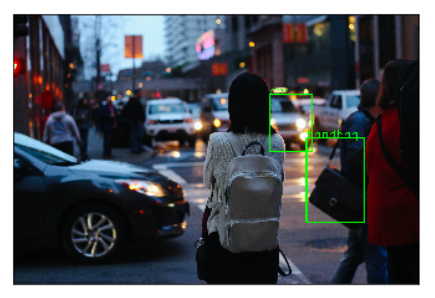

### Abstract

The goal of our project was to identify specific visual relationships in images, to make progress towards genuine scene understanding. We detect object-object relationships in an image based on a textual description given by the user; a subject, object and predicate triplet (for instance, ‘plate next to pizza’). For this, we plan to optimize a triplet loss function using a pre-trained convolutional neural network (VGG16). 

### Teaser Figure

<center></center>

### Introduction

The existing implementations for visual relationship detection output all possible object-object relationships when fed an image. We intend to detect specific object pairs and a relationship predicate between them that match the given textual input while at the same time try and minimize the number of erroneous pairs our model outputs.

### Approach

#### Object Detection & Query Parsing

In our first module of the project, we used the Faster R-CNN object detector in PyTorch. We used the pre-trained Faster R-CNN ResNet-50 model, to process our input image tensor of the form [n, c, h, w] and min size of 800px, where

	- n is the number of images
	- c is the number of channels , for RGB images its 3
	- h is the height of the image
	- w is the width of the image

The model returns: 

	- Bounding boxes [x0, y0, x1, y1] of all predicted classes of shape (N,4) where N is the number of classes predicted by the model to be present in the image.
	- Labels of all predicted classes.
	- Scores of each predicted label.

We also use the <subject, predicate, object> from the input query to obtain all combinations of bounding boxes between <subject, object> detected in the image to pass as input to our next module.

#### Data Collection

We analysed the VRD images' annotations to learn more information about the nature of the dataset and common subjects, predicates and objects, that had more samples. To further simplify the scope of our project, we narrowed the predicates we were considering to the following :

```
	["on", "next to", "behind", "under"]
```

We condensed the VR dataset to contain only relevant examples to the following predicates ending up with 3994 examples in our train set, and 999 images in our test set respectively. These examples contained information about 19370 and 4909 relationships in the above 4 categories, in the train and test set, and the distribution of the relationships are shown below.

<center></center>
<center></center>

There is a slight bias in the dataset towards certain predicates, a problem we solved later by modifying our loss function. We also used heuristics to generate triplets of <anchor, positive, negative> examples, in order to test our approach to solving the problem using a triplet loss function.

#### Model Architectures

Our original thought process was to use the bounding box masks of the <subject, object> pairs in the image to learn the possible relationship between them. We tried 3 different approaches to solve this problem, and have explained them below.

	* Our initial approach was to use the generated bounding box masks for all images in the training dataset, and train a neural network classifier to learn patterns in their spatial arrangement. We used a simple CNN with 5 hidden layers, followed by MaxPooling and BatchNormalization at the end of each hidden layer. This is then followed by 3 Fully Connected layers with a softmax activation in the last layer, to return probabilities for our predicate classes. We performed some basic testing to determine the hyperparameters for the neural network architecture above. The hyperparameters are as follows:

	- Number of hidden layers: 5
	- Activation: ReLU
	- Learning rate: 0.001
	- Dropout (after last hidden layer): 20%
	- Optimizer: Adam

	We noticed our model was biased towards the "on" class, so we changed our loss function from `categorical_crossentropy` to `focal_loss`. Focal loss involves reshaping the cross entropy loss such that it down-weights the loss assigned to well-classified examples. We noticed an improvement in our results, after applying this loss function, though we spent a fair bit if  time tuning the hyperparameters, gamma and alpha, ending up with 4.0 and 1.0. Gamma represents the rate at which easy examples are down-weighted and alpha balances focal loss.

The bounding box information alone was insufficient to detect predicates in an image. We considered using the images themselves but there were issues with this: too many features where each image pixel acts as a feature and images may be of different sizes (whereas bounding boxes can be resized).

	* In our next approach, we used the generated bounding box masks for the <anchor, positive, negative> images in our dataset, and concatenated them with the Glove word embeddings for the <subject, object> to train a neural network using the triplet loss function. We used a simple CNN with 4 hidden layers, followed by MaxPooling at the end of each hidden layer. This is then followed by a Fully Connected layer that generates embeddings of size 7 for the input images. We performed some basic testing to determine the hyperparameters for the neural network architecture above. The hyperparameters are as follows:

		- Number of hidden layers: 4
		- Activation: ReLU
		- Learning rate: 0.0001
		- Optimizer: Adam

	* In our final approach, we felt we could exploit information from within the image itself to allow the model to learn better. We used the generated bounding box masks for the <subject, object> images in our dataset, and used a CNN with 3 stacks of 4 hidden layers, followed by MaxPooling at the end of each stack. The flattened output of this network is then concatenated with the Glove word embeddings for the <subject, object> and the latent vector of the <subject, object> images within their bounding boxes. This vector was generated using weights from the penultimate layer of the AlexNet model as a high-level feature extractor. 

	This is then followed by 3 Fully Connected layers with a softmax activation in the last layer, to return probabilities for our predicate classes. We performed some basic testing to determine the hyperparameters for the neural network architecture above. The hyperparameters are as follows:

		- Number of hidden layers: 12
		- Activation: ReLU
		- Learning rate: 3 * 10^-5 (Epochs 1-2), 1.732 * 10^-5 (Epochs 3-20), 7.598 * 10^-6 (Epochs 20+)
		- Dropout (after each stack): 25%
		- Optimizer: Adam

	We used `focal_loss` as our loss function and also used a ReduceLROnPlateau callback, that decays learning rate when the training loss continues to decrease, but the validation loss plateaus, to take smaller step sizes during optimization.

### Experiments and Results


### Qualitative Results

The language module is able to extract the <s,v,o> from a text input:

<center></center>

For the query <handbag,car> against the following image, our Object Detection module returns 24 images (every combination of the 6 persons and 4 cars detected in the image):

<center></center>
<center></center>
<center></center>
<center></center>

### Conclusion and Future Plan of Action

The next step is to train the model using our prepared dataset. The goal is to train a model that will be able to differentiate between  different kinds of relationships and match them to the queried predicate. We use triplet loss to better train the model and use lesser data at the same time. During testing, we would pass an input image and query to the model and expect it to determine the specified relationship.

We plan to make the pipeline adaptable to more natural textual inputs (full sentences and not just <subject,predicate,object>), as an extension to the projet, if time permits. We would also like to include heuristics-based pair filtering in the Object Detection module, as an optimization.

### References

1. [Satya Mallick's Blog for Faster-RCNN](https://www.learnopencv.com/faster-r-cnn-object-detection-with-pytorch/)
2. [Peter's Github for S,P,O extraction using Spacy](https://github.com/peter3125/enhanced-subject-verb-object-extraction)
3. [NLTK](https://github.com/acrosson/nlp/blob/master/subject_extraction/subject_extraction.py)
4. [Stanford Parser Approach](https://playwithml.wordpress.com/2016/06/15/extracting-relations-or-subject-predicate-object-triples/)
5. [PyTorch for Triplet Loss](https://github.com/andreasveit/triplet-network-pytorch)