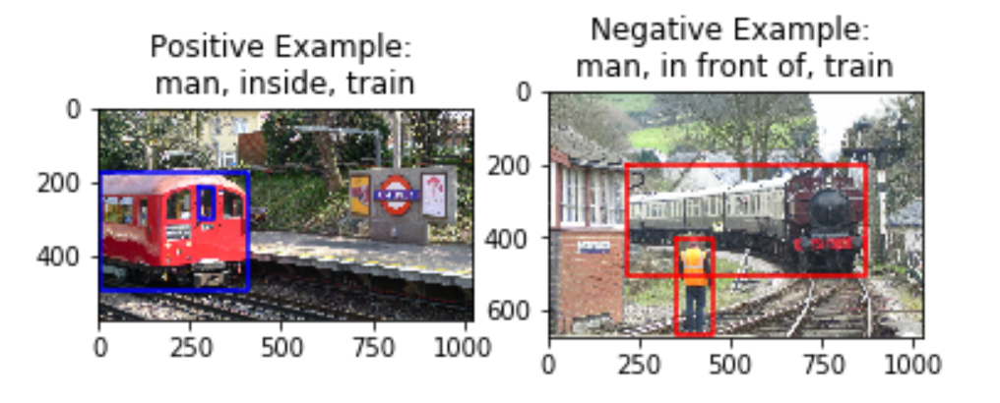

### Abstract

The goal of our project is to identify specific visual relationships in images, to make progress towards genuine scene understanding. We detect object-object relationships in an image based on a textual description given by the user; a subject, object and predicate triplet (for instance, ‘plate next to pizza’). For this, we plan to optimize a triplet loss function using a pre-trained convolutional neural network (VGG16). 

### Teaser Figure

### Introduction

The existing implementations for visual relationship detection output all possible object-object relationships when fed an image. We intend to detect specific object pairs and a relationship predicate between them that match the given textual input while at the same time try and minimize the number of erroneous pairs our model outputs.

### Approach

At this stage in the project, we have explored and obtained results for a few of our proposed modules. 

* Query Parsing - The module is used to extract the <subject, predicate, object> from the input query. After exploring three different approaches to this problem, Spacy, NLTK and Stanford's CoreNLP, we evaluated their results and determined that Spacy had higher precision in detecting <s,p,o> and would work best for our particular use-case. [[Code]](https://github.com/akrishna77/CS6476-TermProject/blob/master/VisRel%20%2B%20All%20Pairs%20Detection.ipynb)

* Object Detection - This module is used to detect <subject, object> pairs, corresponding to the input query. State-of-the-art object detection models currently have really high accuracy, so we used the pretrained weights from a Resnet50 Faster R-CNN model and obtained bounding boxes and categories for objects in the input image. We then tailored our results to return all pairs relevant to the <s,o> in our input query. [[Code]](https://github.com/akrishna77/CS6476-TermProject/blob/master/VisRel%20%2B%20All%20Pairs%20Detection.ipynb)

   For example, for the query <person,car> against the following image, we would return 24 images (every combination of the 6 persons and 4 cars detected in the image):

* Data Exploration - We did some analysis on the VRD images' annotations to learn more information about the nature of the dataset and common subjects, predicates and objects, that had more samples. [[Code]](https://github.com/akrishna77/CS6476-TermProject/blob/master/DataExploration.ipynb)

* Data Collection - Using the VR dataset, we determined positive and negative examples for each of the 70 relationship classes (including ‘on’, ‘next to’, ‘behind’, ‘under’). We accomplished this using heuristics to distinguish negative samples from positive samples against the input image. This mapping is then used to train our model with a triplet loss function that tries to minimize the distance with a positive example while maximizing distance from a negative example. [[Code]](https://github.com/akrishna77/CS6476-TermProject/blob/master/Triplets_Dataset_Creation.ipynb)

   A challenge here is determining a hard negative sample for every predicate. For instance, given an image with a man 'next to' a woman, a good negative image would be one with a man 'behind' a woman. A good positive example would be another image with a ‘next to’ relationship between a man and a woman.

* Training the Model - We have also written baseline code to implement model training using the triplet loss function in PyTorch. This is currently under progress. [[Code]](https://github.com/akrishna77/CS6476-TermProject/blob/master/TripletLossTrain.ipynb)

### Experiments and Results

We have collected 70070 positive and negative pairs for the images in the VRD dataset. 

Here are some examples:

Here, the input description given is ‘tree behind woman’. The image on the left clearly is a good positive example of this relationship (behind) between the subject (tree) and object (woman). The image on the right is a good negative example because it is close enough to the input (same subject and object) but very different in terms of the relationship (the predicate ‘left of’ instead of ‘behind’). 

A challenge we see here is that certain pairs of predicates are semantically very similar (for instance, ‘above’ and ‘over’ or ‘beside’ and ‘by’ could be used interchangeably in most cases). In this case, the negative sample obtained may actually be a good positive sample as a similar relationship is observed by the objects in the image. Due to the scope of the project, we will be limiting predicates to those where our negative sampling works well. 

As of now, we have prepared the dataset and implemented the language and vision sub-modules we would be using. We will now start working on training the model with the collected positive and negative examples for each predicate.

### Conclusion and Future Plan of Action

The next step is to train the model using our prepared dataset. The goal is to train a model that will be able to differentiate between  different kinds of relationships and match them to the queried predicate. We use triplet loss to better train the model and use lesser data at the same time. During testing, we would pass an input image and query to the model and expect it to determine the specified relationship.

We plan to make the pipeline adaptable to more natural textual inputs (full sentences and not just <subject,predicate,object>), as an extension to the projet, if time permits. We would also like to include heuristics-based pair filtering in the Object Detection module, as an optimization.